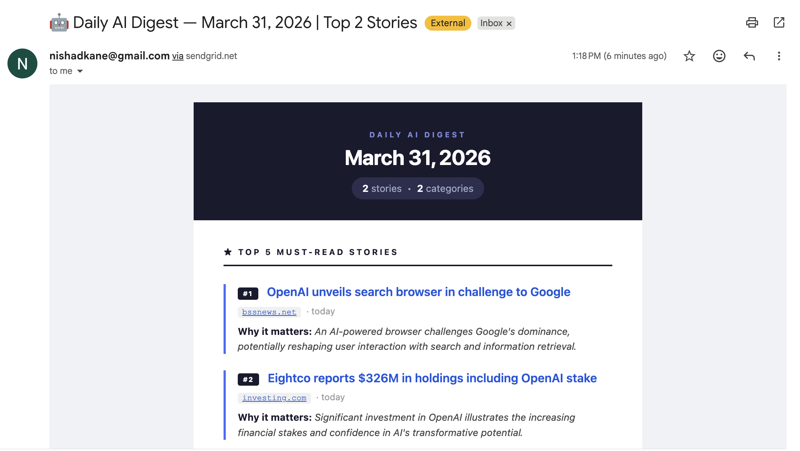

# AI Pulse Digest

A production-ready Python service that delivers a formatted AI news digest to your inbox **4 times daily** — 10 AM, 1 PM, 4 PM, and 8 PM EDT. Powered by OpenAI's `gpt-4o` with `web_search_preview` for live news fetching, and SendGrid for email delivery.

---

## Live Preview



*Real digest delivered to inbox — top AI stories with source, timestamp, and "Why it matters" editorial for each.*

---

## Features

- **Automatic news fetching** — GPT-4o runs 10 targeted search queries covering 30+ AI companies and topics
- **Smart categorization** — Stories clustered into: Model Releases, Product Updates, Research & Papers, Funding & Business, Tools & Frameworks, Policy & Safety
- **Top 5 picks** — Editorially selected must-reads with a one-liner "Why it matters" written for AI/ML engineers
- **Gmail-safe HTML** — Inline CSS, table-based layout, renders correctly in Gmail, Outlook, Apple Mail
- **4x daily delivery** — APScheduler cron fires at 10 AM, 1 PM, 4 PM, 8 PM Eastern — no OS cron needed
- **Robust error handling** — SendGrid retry on failure, logs warnings if < 5 articles found, graceful fallback for LLM errors
- **Safety filters** — Adversarial/prompt-injection content rejected before reaching the summarizer LLM

---

## Tech Stack

| Component | Technology |
|-----------|-----------|
| News fetching | OpenAI `gpt-4o` + `web_search_preview` tool |
| Summarization | OpenAI `gpt-4o` Chat Completions |
| Email templating | Jinja2 (inline CSS, Gmail-safe) |
| Email delivery | SendGrid Python SDK |
| Scheduler | APScheduler 3.x `BackgroundScheduler` |
| Config | python-dotenv |
| Fallback scraping | requests + BeautifulSoup4 + lxml |

---

## Project Structure

```
ai-pulse-digest/
├── main.py                  # Entry point + APScheduler (4x daily cron)
├── news_fetcher.py          # OpenAI web_search_preview — fetches & deduplicates articles
├── summarizer.py            # GPT-4o — categorizes stories + picks Top 5
├── email_builder.py         # Jinja2 HTML email renderer
├── email_sender.py          # SendGrid delivery with 60s retry
├── templates/
│   └── digest_email.html    # Gmail-safe Jinja2 HTML template
├── logs/                    # Rotating logs (5MB × 3 backups, gitignored)
├── .env.example             # Template — copy to .env and fill in secrets
├── requirements.txt         # Pinned dependencies
├── CLAUDE.md                # Full architecture, deploy guide, safety rules
└── screenshot.png           # Live email preview
```

---

## Quick Start

### 1. Prerequisites

- Python 3.11+
- [OpenAI API key](https://platform.openai.com/api-keys) with available credits
- [SendGrid account](https://sendgrid.com) (free tier: 100 emails/day)
  - Verify your sender email in SendGrid → Settings → Sender Authentication

### 2. Install

```bash
git clone https://github.com/nishad2725/ai-pulse-digest.git
cd ai-pulse-digest

python3.11 -m venv venv
source venv/bin/activate      # Windows: venv\Scripts\activate
pip install -r requirements.txt
```

### 3. Configure

```bash
cp .env.example .env
```

Edit `.env`:

```ini
OPENAI_API_KEY=sk-proj-...
SENDGRID_API_KEY=SG....
FROM_EMAIL=verified-sender@yourdomain.com
TO_EMAIL=your-inbox@gmail.com
SCHEDULE_HOURS=10,13,16,20
SCHEDULE_MINUTE=0
SCHEDULE_TIMEZONE=America/New_York
```

### 4. Test the full pipeline

```bash
python main.py --test
```

This runs the complete pipeline immediately — fetches live news, summarizes, renders, and delivers the email. Check your inbox and `logs/digest.log`.

### 5. Start the scheduler

```bash
python main.py
```

Runs continuously, firing at 10 AM, 1 PM, 4 PM, and 8 PM Eastern every day.

---

## Deployment

### VPS (Ubuntu 22.04) with systemd

```bash
# Copy project to server
scp -r ai-pulse-digest/ user@your-vps:/opt/ai-pulse-digest/
ssh user@your-vps

cd /opt/ai-pulse-digest
python3.11 -m venv venv && source venv/bin/activate
pip install -r requirements.txt
cp .env.example .env && nano .env
```

Create `/etc/systemd/system/ai-pulse-digest.service`:

```ini
[Unit]
Description=AI Pulse Digest — Daily AI News Emailer
After=network-online.target

[Service]
Type=simple
User=ubuntu
WorkingDirectory=/opt/ai-pulse-digest
EnvironmentFile=/opt/ai-pulse-digest/.env
ExecStart=/opt/ai-pulse-digest/venv/bin/python main.py
Restart=on-failure
RestartSec=30

[Install]
WantedBy=multi-user.target
```

```bash
sudo systemctl daemon-reload
sudo systemctl enable ai-pulse-digest
sudo systemctl start ai-pulse-digest
sudo journalctl -u ai-pulse-digest -f   # tail logs
```

### Railway / Render

Add a `Procfile`:
```
worker: python main.py
```

Set all env vars from `.env.example` in the platform dashboard. No OS cron needed — APScheduler handles scheduling internally.

### Background with nohup

```bash
nohup python main.py >> logs/digest.log 2>&1 &
echo $! > /tmp/ai-digest.pid
```

---

## Sources Monitored

**Companies & products:** OpenAI · ChatGPT · GPT-5 · Anthropic · Claude · Google DeepMind · Gemini · xAI · Grok · Perplexity AI · Mistral · Cohere · Meta AI · Llama · Apple Intelligence · Microsoft Copilot · Amazon Bedrock · NVIDIA AI · Hugging Face · Groq · Ollama · LangChain · LangGraph · CrewAI · AutoGen · Cursor · Devin · Replit AI · Stability AI · Midjourney · Runway · ElevenLabs

**Topics:** LLM releases · foundation models · fine-tuning · RAG · AI agents · multimodal AI · reasoning models · AI infrastructure · GPU clusters · AI regulation · AI safety · model benchmarks · transformer architecture · vector databases · AI funding rounds · AI acquisitions

---

## Safety Rules

- **No hallucinated URLs** — every link must come directly from the web search tool response
- **Adversarial content filter** — rejects articles with prompt-injection patterns before LLM processing
- **No paywalled scraping** — BeautifulSoup fallback only accesses public article pages
- **No paid scraping services** — OpenAI `web_search_preview` only for content discovery
- **Disk-safe logging** — rotating handler caps log storage at ~15MB

---

## Environment Variables

| Variable | Description |
|---|---|
| `OPENAI_API_KEY` | OpenAI platform API key |
| `SENDGRID_API_KEY` | SendGrid API key (Mail Send permission) |
| `FROM_EMAIL` | Verified sender email in SendGrid |
| `TO_EMAIL` | Destination inbox |
| `SCHEDULE_HOURS` | Comma-separated 24h hours, e.g. `10,13,16,20` |
| `SCHEDULE_MINUTE` | Minute past the hour, e.g. `0` |
| `SCHEDULE_TIMEZONE` | IANA timezone, e.g. `America/New_York` |

---

## License

MIT
